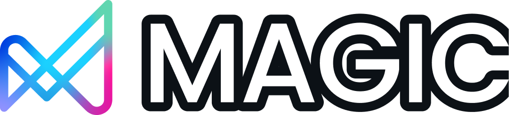
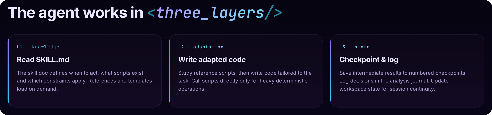

<p align="center">
  
</p>

# MAGIC Agent Skills

[](https://skills.sh/Votee-AI/magic-agent-skills)
[](https://www.npmjs.com/package/@votee-ai/magic-agent-skills)
[](https://github.com/Votee-AI/magic-agent-skills/actions/workflows/ci.yml)
[](LICENSE)

**30 agent skills for LLM training data preparation, data science, and computational linguistics.**

MAGIC (Multi-Agent Generic Intelligence Capabilities) turns any AI coding assistant into a specialist for the data work behind LLM development — from raw data ingestion and cleaning through synthesis, annotation, tokenizer auditing, and evaluation. Works with Claude Code, Cursor, Windsurf, Gemini CLI, and [30 AI tools in total](#supported-tools).

## How It Works

Each skill is a **self-contained knowledge package**. When an agent receives a task:

1. Agent reads `SKILL.md` → gets domain knowledge, code patterns, and procedures
2. Agent reads `references/*.md` → gets detailed patterns on demand
3. Agent reads `scripts/*.py` → sees reference implementations (not executed directly)
4. Agent **writes its own code** adapted to the specific task

Skills provide knowledge and patterns. The agent decides how to act — it may follow the reference scripts closely, adapt them, or write entirely custom code.



## Skills

### Data Science (12 skills)

Skills for the core data pipeline — loading, profiling, cleaning, transforming, validating, and delivering datasets for LLM training and fine-tuning.

| Skill | Description |
|-------|-------------|
| `magic-workspace-init` | Workspace scaffolding, environment verification, dependency installation |
| `magic-data-lifecycle` | Multi-skill orchestration, routing, quality gating |
| `magic-data-loading` | Multi-format file detection, auto-encoding, CJK support, databases, HuggingFace |
| `magic-data-profiling` | Quality scoring, distribution analysis, outlier detection, correlation |
| `magic-data-cleaning` | Missing values, normalization, sentinel replacement, cleaning plans |
| `magic-data-validation` | Schema inference, constraint checking, fitness-for-use assessment |
| `magic-data-exploration` | Pattern discovery, segment analysis, relationship exploration |
| `magic-data-transformation` | Reshape, aggregate, merge, derive columns, deliver to DB/HuggingFace |
| `magic-data-synthesis` | LLM-based generation via DataDesigner — fill missing, translate, enrich |
| `magic-statistical-analysis` | Descriptive stats, hypothesis testing, correlation analysis |
| `magic-data-visualization` | Chart selection, generation (static + interactive), validation |
| `magic-report-generation` | Structured report assembly, table formatting |

### Computational Linguistics (18 skills)

Skills for low-resource language NLP — tokenizer auditing, corpus building, morphological analysis, annotation, cross-lingual transfer, and evaluation. Essential for extending LLMs to new languages.

| Skill | Description |
|-------|-------------|
| `linguistic-orchestrator` | Routes tasks to the appropriate linguistic skill |
| `linguistic-scope` | Language assessment and resource classification |
| `linguistic-tokenize` | Tokenizer fertility audit, vocab extension strategy |
| `linguistic-corpus` | Corpus collection and curation |
| `linguistic-morph` | Morphological analysis and generation |
| `linguistic-syntax` | Syntactic parsing and treebanks |
| `linguistic-semantics` | Word embeddings and semantic similarity |
| `linguistic-lexicon` | Lexicon building and management |
| `linguistic-annotate` | Annotation project design, IAA metrics |
| `linguistic-bitext` | Parallel corpus alignment |
| `linguistic-codeswitch` | Code-switching detection and handling |
| `linguistic-discourse` | Discourse analysis and coherence |
| `linguistic-ethics` | Ethical considerations for language technology |
| `linguistic-eval` | Evaluation methodology and benchmarks |
| `linguistic-historical` | Historical linguistics and language change |
| `linguistic-scripts` | Writing system analysis and conversion |
| `linguistic-speech` | Speech processing and phonology |
| `linguistic-transfer` | Cross-lingual transfer and adaptation |

## Installation

### Prerequisites

- **Node.js 20+** — required for the CLI installer
- **Python 3.12+** — required for skill scripts and reference implementations
- After installing, run `pip install -r requirements.txt` for Python dependencies

### Option 1: skills.sh (Recommended)

Install all 30 skills at once:

```bash
npx skills add Votee-AI/magic-agent-skills
```

Or install a specific skill:

```bash
npx skills add Votee-AI/magic-agent-skills --skill magic-data-cleaning
```

### Option 2: CLI Installer

Granular suite/skill selection with tool detection for 30 AI coding tools:

```bash
# Interactive — auto-detects tools in your project
npx @votee-ai/magic-agent-skills init

# Non-interactive — specify tools directly
npx @votee-ai/magic-agent-skills init --tools claude,cursor,windsurf

# Install only data-agent skills
npx @votee-ai/magic-agent-skills init --suite data-agent

# Install only linguistic skills
npx @votee-ai/magic-agent-skills init --suite linguistic
```

### Option 3: Claude Plugin Marketplace

```
/plugin marketplace add Votee-AI/magic-agent-skills
```

### Option 4: Manual

Clone the repo and copy the skills you need:

```bash
git clone https://github.com/Votee-AI/magic-agent-skills.git
cp -r magic-agent-skills/skills/magic-data-cleaning .claude/skills/
```

## Supported Tools

The CLI installer supports 30 AI coding tools including:

Claude Code, Cursor, Windsurf, Gemini CLI, Cline, Aider, Continue, Copilot, Amazon Q, Tabnine, Sourcegraph Cody, JetBrains AI, Zed AI, Replit AI, and more.

Run `npx @votee-ai/magic-agent-skills init` to auto-detect which tools are in your project.

## Project Structure

```
magic-agent-skills/
├── skills/                     # 30 skill packages + shared utilities
│   ├── magic-data-*/           # 12 data science skills
│   │   ├── SKILL.md            # Knowledge document + frontmatter
│   │   ├── scripts/            # Reference Python implementations
│   │   ├── references/         # Additional reference material
│   │   └── tests/              # Per-skill unit tests (co-located)
│   ├── linguistic-*/           # 18 linguistics skills
│   │   ├── SKILL.md            # Knowledge document + frontmatter
│   │   ├── scripts/            # Reference implementations (where applicable)
│   │   ├── references/         # Linguistic references
│   │   ├── evals/              # Skill-specific evaluation data
│   │   └── tests/              # Per-skill tests (where applicable)
│   └── _linguistic_shared/     # Shared Python utilities (not a skill)
├── tests/                      # Cross-cutting validation tests
│   ├── unit/                   # Structure, triggers, consistency checks
│   ├── integration/            # Multi-skill workflow tests
│   └── e2e/                    # End-to-end pipeline scenarios
├── commands/
│   ├── data-agent/             # 13 data-agent slash commands
│   └── linguistic/             # 10 linguistic slash commands
├── cli/                        # npm CLI installer
├── schema/
│   └── SKILL.schema.json       # Frontmatter validation schema
├── docs/images/                # Logo and architecture diagrams
├── .claude-plugin/
│   └── marketplace.json        # Claude plugin manifest
├── skills.sh.json              # skills.sh registry grouping
└── RELEASING.md                # Versioning and release policy
```

## Contributing

See [CONTRIBUTING.md](CONTRIBUTING.md) for branch strategy, PR process, and development setup.

## License

[Apache-2.0](LICENSE)

---

Built by [Votee AI](https://votee.com)
